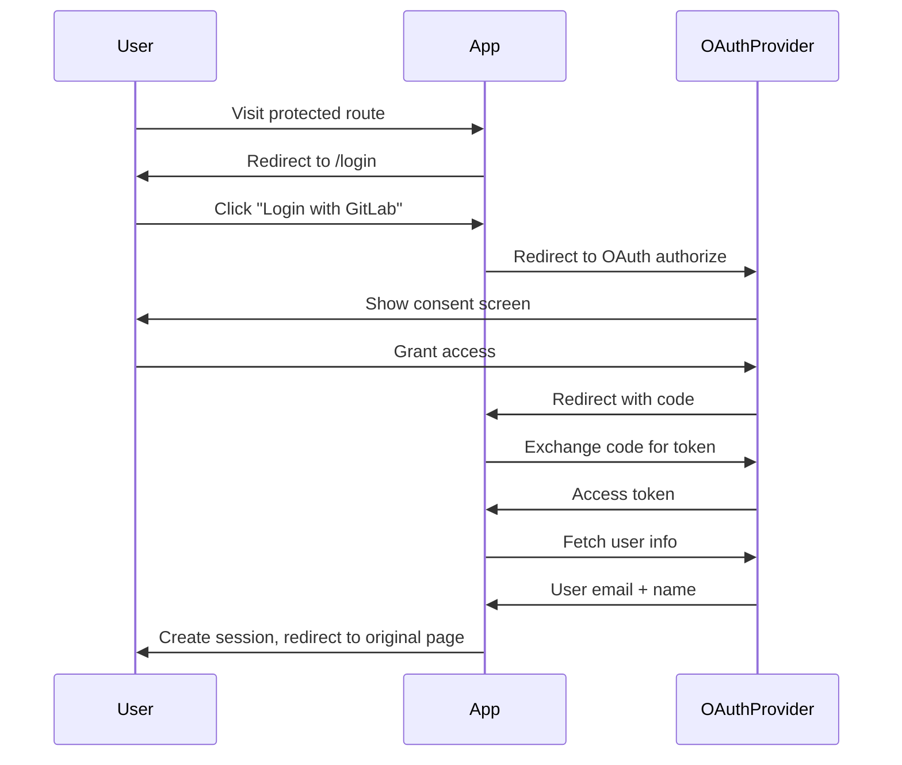

# OAuth2 Authentication Specification

## Overview
Add OAuth2 authentication with GitLab/Forgejo to protect admin routes while keeping schedule view public.

## Protected Routes
- **Public (no auth required)**:
  - `/` - Dashboard/Schedule view
  - `/calendar/{token}/ics` - Calendar feed
  - `/schedule/current` - Current schedule view

- **Protected (auth required)**:
  - `/team` - Team management
  - `/leave/report` - Report leave
  - `/schedule/generate` - Generate schedule
  - `/calendar` - Calendar subscriptions

## Architecture

### OAuth2 Flow


### Database Schema

```sql
-- Users table (managed via OAuth)
CREATE TABLE users (
    id TEXT PRIMARY KEY,
    email TEXT UNIQUE NOT NULL,
    name TEXT NOT NULL,
    provider_user_id TEXT NOT NULL,
    provider TEXT NOT NULL,  -- 'gitlab' or 'forgejo'
    is_active INTEGER DEFAULT 1,
    created_at DATETIME DEFAULT CURRENT_TIMESTAMP
);

-- User sessions
CREATE TABLE user_sessions (
    id TEXT PRIMARY KEY,
    user_id TEXT NOT NULL,
    session_token TEXT UNIQUE NOT NULL,
    expires_at DATETIME NOT NULL,
    created_at DATETIME DEFAULT CURRENT_TIMESTAMP,
    FOREIGN KEY (user_id) REFERENCES users(id)
);

-- OAuth tokens
CREATE TABLE oauth_tokens (
    id TEXT PRIMARY KEY,
    user_id TEXT NOT NULL,
    provider TEXT NOT NULL,
    access_token TEXT NOT NULL,
    refresh_token TEXT,
    expires_at DATETIME,
    created_at DATETIME DEFAULT CURRENT_TIMESTAMP,
    FOREIGN KEY (user_id) REFERENCES users(id)
);
```

### Models

```go
type User struct {
    ID             string    `json:"id"`
    Email          string    `json:"email"`
    Name           string    `json:"name"`
    ProviderUserID string    `json:"provider_user_id"`
    Provider       string    `json:"provider"`
    IsActive       bool      `json:"is_active"`
    CreatedAt      time.Time `json:"created_at"`
}

type UserSession struct {
    ID           string    `json:"id"`
    UserID       string    `json:"user_id"`
    SessionToken string    `json:"session_token"`
    ExpiresAt    time.Time `json:"expires_at"`
    CreatedAt    time.Time `json:"created_at"`
}

type OAuthToken struct {
    ID           string    `json:"id"`
    UserID       string    `json:"user_id"`
    Provider     string    `json:"provider"`
    AccessToken  string    `json:"access_token"`
    RefreshToken string    `json:"refresh_token,omitempty"`
    ExpiresAt    time.Time `json:"expires_at"`
    CreatedAt    time.Time `json:"created_at"`
}
```

## Configuration

Environment variables:
```bash
# OAuth Provider
OAUTH_PROVIDER=gitlab  # or forgejo
OAUTH_CLIENT_ID=your_client_id
OAUTH_CLIENT_SECRET=your_client_secret
OAUTH_AUTH_URL=https://gitlab.com/oauth/authorize
OAUTH_TOKEN_URL=https://gitlab.com/oauth/token
OAUTH_USER_URL=https://gitlab.com/api/v4/user
OAUTH_REDIRECT_URL=http://localhost:8080/auth/callback

# Session
SESSION_SECRET=your_session_secret
SESSION_MAX_AGE=86400  # 24 hours in seconds
```

## Implementation Plan

### Phase 1: Database & Models
1. Add OAuth2 dependencies
2. Create database schema
3. Add SQLC queries
4. Create models

### Phase 2: Auth Logic
5. Create auth package with OAuth2 flow
6. Implement session management
7. Add authentication middleware

### Phase 3: Web Integration
8. Create login page template
9. Implement login/callback handlers
10. Update existing handlers with auth middleware
11. Update templates for auth-aware UI

### Phase 4: Configuration & Testing
12. Add configuration loading
13. Create setup documentation
14. Add integration tests

## Key Components

### 1. Auth Package (`internal/auth/`)
- `oauth.go` - OAuth2 flow logic
- `session.go` - Session management
- `middleware.go` - Auth middleware
- `provider.go` - Provider configuration

### 2. Database Layer
- New tables in schema
- SQLC queries for auth operations
- Wrapper methods for user/session management

### 3. Web Handlers
- New routes: `/login`, `/auth/callback`, `/logout`
- Middleware applied to protected routes
- Session validation on each request

### 4. Templates
- `login.html` - OAuth login page
- Updated navigation to show/hide admin links
- Auth state in template data

## Security Considerations

1. **Session Security**
   - Secure cookies (HTTPS only in production)
   - HTTP-only cookies
   - CSRF protection
   - Session expiration

2. **OAuth Security**
   - State parameter to prevent CSRF
   - PKCE for additional security
   - Token validation
   - Secure token storage

3. **Access Control**
   - Middleware checks session validity
   - Routes explicitly define auth requirements
   - Graceful handling of expired sessions

## Testing Strategy

1. **Unit Tests**
   - Session creation/validation
   - OAuth flow logic
   - Middleware behavior

2. **Integration Tests**
   - Full OAuth flow simulation
   - Protected route access
   - Session expiration

3. **Manual Testing**
   - GitLab OAuth integration
   - Forgejo OAuth integration
   - Session lifecycle
   - Access control

## Migration Path

For existing deployments:
1. Add new tables (non-destructive)
2. Configure OAuth credentials
3. Users can login immediately
4. No data migration needed

## Example Configuration

### GitLab
```bash
OAUTH_PROVIDER=gitlab
OAUTH_AUTH_URL=https://gitlab.com/oauth/authorize
OAUTH_TOKEN_URL=https://gitlab.com/oauth/token
OAUTH_USER_URL=https://gitlab.com/api/v4/user
```

### Forgejo
```bash
OAUTH_PROVIDER=forgejo
OAUTH_AUTH_URL=https://forgejo.example.com/login/oauth/authorize
OAUTH_TOKEN_URL=https://forgejo.example.com/login/oauth/access_token
OAUTH_USER_URL=https://forgejo.example.com/api/v1/user
```

## Files to Create/Modify

### New Files
```
internal/
├── auth/
│   ├── oauth.go
│   ├── session.go
│   ├── middleware.go
│   └── provider.go
├── database/
│   ├── auth.go          (user/session methods)
│   ├── models.go        (add new models)
│   └── sqlc/
│       ├── schema.sql   (add new tables)
│       ├── queries/
│       │   └── auth.sql
│       └── auth.sql.go  (generated)
└── web/
    ├── handlers_auth.go
    └── templates/
        └── login.html
```

### Modified Files
```
internal/
├── web/
│   ├── handlers.go      (add auth middleware)
│   └── templates/
│       ├── dashboard.html
│       ├── team.html
│       ├── leave_report.html
│       ├── schedule_generate.html
│       └── calendar.html
├── database/
│   └── db.go            (add auth methods)
└── api/
    └── server.go        (add auth routes)
```

## Next Steps

1. Review this specification
2. Confirm OAuth provider details
3. Provide OAuth client credentials
4. Start implementation